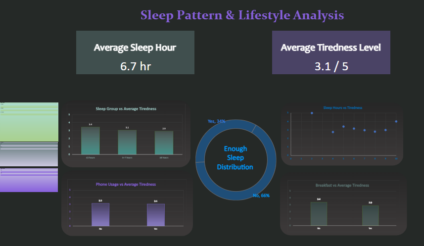

# Sleep Pattern & Lifestyle Analysis: A Human Performance Case Study
## An End-to-End Data Analytics Project investigating the drivers of daily fatigue.

## Overview
This end-to-end project investigates why 66% of people feel they don't get enough sleep, even when they average 6.7 hours of rest. I analyzed a dataset of 103 individuals to see if morning nutrition and phone habits impact tiredness more than sleep duration itself.

## Problem Statement
Most health advice focuses purely on "sleep hours." However, productivity remains low even for those meeting these goals.
    
   **The Goal:** Identify if "Quality" factors (Breakfast, Phone proximity) have a higher ROI (Return on Investment) for alertness than simply "Quantity" of sleep.

## Dataset
- Source: sleep_data.csv (Kaggle)
- Records: Survey based lifestyle and sleep data

## Dashboard Preview

## Business Intelligence Dashboard
The final dashboard was built in Excel, featuring dynamic KPIs, Slicers for interactivity, and a high-contrast "Dark Mode" aesthetic for professional readability.

# Key Performance Indicators (KPIs)
- **Average Sleep Duration:** 6.7 hours
- **Average Tiredness Level:** 3.1 / 5.0
- **Sleep Dissatisfaction Rate:** 66% of respondents feel they do not get enough sleep.

## The Analytical Workflow (Data Preparation)
To ensure the integrity of the insights, I followed a professional data pipeline:
   - **Data Normalization:** Cleaned and standardized Binary Variables (Breakfast, Phone Usage, Phone Reach) to ensure 100% accuracy in Pivot Table aggregations.
   - **Feature Engineering (Data Binning):** I applied Data Binning to the continuous Sleep_Hours variable to reduce "granularity noise." I created three distinct cohorts:
     * High Risk (≤5 hrs)
       
     * Sub-optimal (6–7 hrs)
       
     * Target/Healthy (≥8 hrs)
       
   - **Quantitative Scaling:** Analyzed the Tired_Level as a 1–5 Likert Scale, calculating weighted averages to provide a "Fatigue Score" for different lifestyle segments.
     
      * **1 - Peak Vitality** (Maximum energy; optimal cognitive performance)
     
      * **2 - Functional** (Normal daily energy; no significant fatigue reported)
     
      * **3 - Moderately Fatigued**(Population Mean: 3.1) Notable dip in energy; productivity starts to decline
     
      * **4 - Highly Exhausted** (Significant fatigue impacting productivity and mood)
     
      * **5 - Critical Fatigue** (Extreme exhaustion, difficulty performing tasks effectively)
     
   - **Statistical Validation (Correlation Analysis):** Executed a Pearson Correlation (r = -0.19) in Excel. This mathematically confirmed a weak relationship between sleep hours and fatigue, identifying that "Quantity" alone was not the primary driver of tiredness.
   - **Integrity Check:** Resolved data type inconsistencies (Text vs. Number) to ensure all KPI cards reflected accurate mathematical means.
   - **Pivot Table Architecture:** Developed a robust backend using Pivot Tables to allow for multi-dimensional filtering via Slicers.
   - **Visualization Strategy:**
     * **Donut Charts:-** Used to represent the distribution of the binary variable “Enough Sleep”.
     
     * **Bar Charts:-** Used for categorical comparisons such as Breakfast habits and Phone Usage.
     
     * **Scatter Plots:-** Used to visualize the correlation between Sleep Hours and Tiredness Averages, identifying non-linear trends across different sleep cohorts.

## Key Insights
   - **The Sleep Satisfaction Gap:** While the average sleep duration is 6.7 hours, the Enough Sleep Distribution reveals a 66% dissatisfaction rate. This indicates a perception deficit, where individuals believe they are getting sufficient sleep, but fatigue levels and satisfaction data suggest otherwise.
   - **The Nutritional Lever:** Analysis shows that skipping breakfast is associated with a 15% increase in fatigue scores (3.4 vs 2.9 baseline). This identifies morning nutrition as a high-impact, low-cost intervention for improving daily focus and energy levels.
   - **The Digital Masking Paradox:** The data reveals a surprising trend: individuals who reported No late-night phone usage actually had a higher fatigue score (3.2) than those who did (3.0). This suggests a 'Digital Stimulation' effect where screen time might be temporarily masking perceived tiredness, even if it's not providing real rest.
     
## Business Takeway
- **The "Breakfast Boost":** Eating breakfast is the fastest way to lower fatigue. It reduces tiredness by 15%, making it more effective than just sleeping an extra hour.
- **Fix the "6-7 Hour" Trap:** People sleeping 6–7 hours actually feel more tired than those sleeping less. The goal should be reaching 8+ hours to see a real energy improvement.
- **Phone Habits Matter:** Keeping a phone nearby at night leads to higher exhaustion. Improving "Digital Hygiene" is a zero-cost way to make sleep feel more restful.

## Conclusion
This study proves that sleep quantity is not the only factor in energy. While 6.7 hours is the average sleep time, 66% of people still feel tired. The data shows a weak correlation (r = -0.19) between sleep hours and tiredness, meaning that lifestyle choices—like eating breakfast and putting the phone away—are often more important than the time spent in bed. To truly beat fatigue, we must focus on quality habits, not just the clock.

## Project Limitations
To maintain transparency, the following limitations were considered:
- **Sample Size (N = 103):** The dataset is relatively small, so findings are useful for trends but may not represent the entire population.
- **Self-Reporting Bias:** Tiredness levels are based on personal perception, which can vary between individuals.
- **Adrenaline Masking:** In very low sleep cases (≤5 hours), people may report lower fatigue due to temporary alertness from stress, which can affect accuracy.
- **Correlation vs Causation:** The analysis identifies relationships (e.g., breakfast and tiredness) but does not prove direct cause-and-effect.
